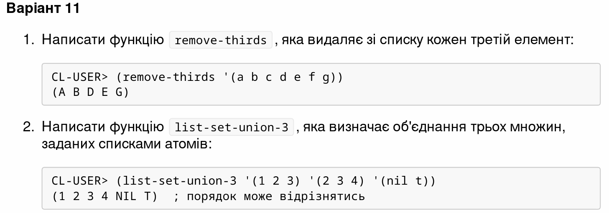

<p align="center"><b>МОНУ НТУУ КПІ ім. Ігоря Сікорського ФПМ СПіСКС</b></p>

<p align="center">
<b>Звіт з лабораторної роботи 2</b><br/>
"Рекурсія"<br/>
з дисципліни "Вступ до функціонального програмування"
</p>

<p align="right"><b>Студент</b>: Луценко Б. А.<p>
<p align="right"><b>Група</b>: КВ-13<p>
<p align="center"><b>Рік</b>: 2024</p>

<div style="page-break-after: always;"></div>

## Загальне завдання

Реалізуйте дві рекурсивні функції, що виконують деякі дії з вхідним(и) списком(-ами), за можливості/необхідності використовуючи різні види рекурсії. Функції, які необхідно реалізувати, задаються варіантом (п. 2.1.1). Вимоги до функцій:

1. Зміна списку згідно із завданням має відбуватись за рахунок конструювання нового списку, а не зміни наявного (вхідного).
2. Не допускається використання функцій вищого порядку чи стандартних функцій для роботи зі списками, що не наведені в четвертому розділі навчального посібника.
3. Реалізована функція не має бути функцією вищого порядку, тобто приймати функції в якості аргументів.
4. Не допускається використання псевдофункцій (деструктивного підходу).
5. Не допускається використання циклів. Кожна реалізована функція має бути протестована для різних тестових наборів. Тести мають бути оформленні у вигляді модульних тестів (див. п. 2.3).

```lisp
;;; Task for variant:
(rem 11 15) ; 11
11
```

## Варіант 11(11)
<p align="center">

</p>

## Лістинг функції `remove-thirds`

```lisp
( defun remove-thirds ( lst )
  "Remove every third element from the `lst`"
  ; If the list is not empty
  ( if lst
    ; Append the first element to the result list.
    ( append
      ( list ( first lst ) )
      ; If the second element exists, append it to the result list
      ( if (second lst)
        ( list ( second lst ) )
      )
      ; Recursively call the function with the rest of the list
      ( remove-thirds ( nthcdr 3 lst ) )
    )
  )
)
```

### Тестові набори

```lisp
( defun test-remove-thirds ()
  "Test the `remove-thirds` function"
  ( check #'remove-thirds "Empty list" NIL NIL )
  ( check #'remove-thirds "Single element" '(1) '(1) )
  ( check #'remove-thirds "Two elements" '(1 2) '(1 2) )
  ( check #'remove-thirds "Three elements" '(1 2) '(1 2 3) )
  ( check #'remove-thirds "Multiple elements" '(1 2 4 5 7 8) '(1 2 3 4 5 6 7 8 9) )
  ( check #'remove-thirds "Letters" '(a b d e) '(a b c d e f) )
)
```

### Тестування

```lisp
( test-remove-thirds )
passed... Empty list
passed... Single element
passed... Two elements
passed... Three elements
passed... Multiple elements
passed... Letters
NIL
```

## Лістинг функції `list-set-union-3`

```lisp
( defun is-member (n lst)
  "Return T if `n` is a member of `lst`, NIL otherwise"
  ( if lst
    ( if ( eql ( car lst ) n)
      T
      (
        is-member n ( cdr lst )
      )
    )
    NIL
  )
)

( defun make-set ( n lst )
  "Return 'settified' version of the `lst`"
  ( if lst
    ( if ( is-member n lst)
      ( make-set ( car lst ) (cdr lst ) )
      ( append ( list n ) ( make-set ( car lst ) (cdr lst ) ) )
    )
    ( list n )
  )
)

( defun list-set-union-3 ( lst1 lst2 lst3 )
  "Return the union of three lists"
  (let ((l (append lst1 lst2 lst3)))
    (if l
      ( make-set ( car l ) ( cdr l ) )
      nil
    )
  )
)
```

### Тестові набори для `list-set-union-3`

```lisp
( defun test-list-set-union-3 ()
  "Test the `list-set-union-3` function"
  ; check (function name, expected result, input)
  ( check #'list-set-union-3 "Empty lists" nil nil nil nil )
  ( check #'list-set-union-3 "Single element" '(1) '(1) '(1) '(1) )
  ( check #'list-set-union-3 "Two elements" '(1 2) '(1 2) '(1 2) '(1 2) )
  ( check #'list-set-union-3 "Three elements" '(1 2 3) '(1 2 3) '(1 2 3) '(1 2 3) )
  ( check #'list-set-union-3 "Multiple elements" '(3 5 2 4 1) '(1 3 5) '(2 4) '(1))
  ( check #'list-set-union-3 "Letters" '(d c a b) '(b b b b c d c d) '(a a a a b c) '(a b))
  ( check #'list-set-union-3 "Mixed" '(1 a b c) '(1 1 1 a b c) '(1 1 1 a b c) '(1 1 1 a b c) )
  ( check #'list-set-union-3 "Mixed with NIL, T" '(1 T b c d NIL 23) '(1 1 1 T b c d NIL 23) '(1 1 1 T b c d NIL 23) '(1 1 1 T b c d NIL 23) )
)
```

### Тестуванння `list-set-union-3`

```lisp
( test-list-set-union-3 )
passed... Empty lists
passed... Single element
passed... Two elements
passed... Three elements
passed... Multiple elements
passed... Letters
passed... Mixed
passed... Mixed with NIL, T
NIL
```
